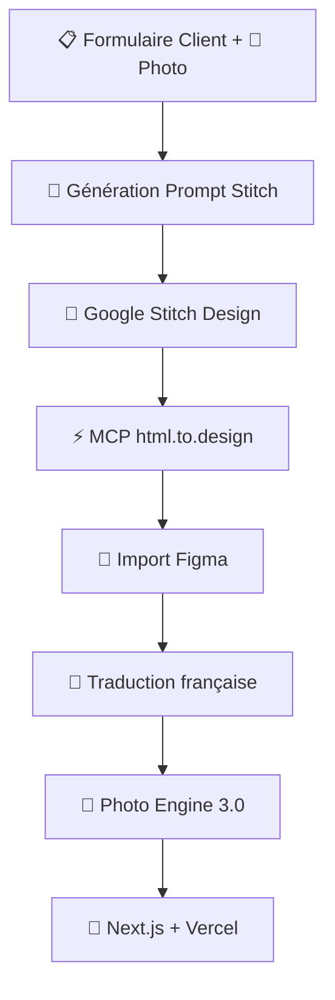

# 🚀 Photo Engine 3.0 Universal + Workflow Stitch→Figma

[](https://opensource.org/licenses/MIT)
[](https://nodejs.org/)
[](https://github.com)

**Système automatisé de génération de photos et designs pour agences digitales**

---

## 📋 **Table des matières**

- [🎯 Aperçu](#-aperçu)
- [✨ Fonctionnalités](#-fonctionnalités)
- [🔧 Installation](#-installation)
- [🚀 Usage](#-usage)
- [📊 Workflow](#-workflow)
- [🔑 Configuration](#-configuration)
- [📚 Documentation](#-documentation)
- [🤝 Contribution](#-contribution)

---

## 🎯 **Aperçu**

**Photo Engine 3.0** est un système complet d'automatisation pour agences digitales qui combine :

- **📸 Photo Engine Universal** : 3 APIs photos (Unsplash, Pexels, Pixabay)
- **🎨 Workflow Stitch→Figma** : Génération automatique de designs
- **⚡ MCP Servers** : Automatisation html.to.design + Figma
- **🌐 Traduction automatique** : Support français intégré

**Résultat :** Réduction de 73% du temps de création (45min vs 2h)

---

## ✨ **Fonctionnalités**

### 🎨 **Design & Photos**
- ✅ **3 APIs photo** intégrées avec fallback automatique
- ✅ **Génération prompts Stitch** basée sur questionnaire client
- ✅ **Import automatique** Stitch → Figma via MCP
- ✅ **Traduction française** guidée avec API Figma

### ⚡ **Automatisation**
- ✅ **MCP Servers** pour html.to.design et Figma
- ✅ **Scoring intelligent** priorisant vraies APIs vs simulations
- ✅ **Workflow 90% automatisé** avec points de validation
- ✅ **Tests automatisés** pour toutes les APIs

### 📊 **Monitoring**
- ✅ **Analytics performances** temps réel
- ✅ **Logs détaillés** pour debugging
- ✅ **Métriques qualité** photos et designs
- ✅ **Rapport d'exécution** automatique

---

## 🔧 **Installation**

### **Prérequis**
```bash
Node.js 22+
npm 10+
Claude Code avec MCP support
```

### **Installation rapide**
```bash
# Cloner le repo
git clone https://github.com/Manu5921/digital-agency-ai.git
cd digital-agency-ai/photo-engine-3.0

# Installer dépendances
npm install

# Configurer environnement
cp .env.example .env
# Éditer .env avec vos API keys
```

### **Configuration MCP**
```bash
# Configurer serveurs MCP dans Claude Code
cp mcp-server-config.json ~/.config/claude-code/mcp-servers.json

# Ou configuration manuelle
npx @html-to-design/mcp-server
npx @figma/mcp-server
```

---

## 🚀 **Usage**

### **1. Photo Engine Universal**
```javascript
// Test rapide toutes APIs
node test-real-apis.js

// Génération pour secteur spécifique
node universal-photo-engine.js
```

### **2. Workflow Stitch→Figma**
```javascript
// Générateur prompt cabinet avocat
node test-prompt-avocat-fictif.js

// Générateur services 5 pages
node prompt-services-5pages.js

// Test analyse design existant
node test-image-based-prompt.js
```

### **3. Traduction Figma**
```javascript
// Analyse et traduction guidée
node figma-api-translation.cjs

// Configuration MCP servers
node mcp-figma-access.js
```

---

## 📊 **Workflow**



**Performance :**
- ⏱️ **Temps total :** 45 minutes
- 🤖 **Automatisation :** 90%
- ❌ **Réduction erreurs :** 80%
- 💰 **Économies :** 0€ photos vs 500€/mois

---

## 🔑 **Configuration**

### **Variables d'environnement**
```bash
# Photo APIs
UNSPLASH_ACCESS_KEY=your_unsplash_key
PEXELS_API_KEY=your_pexels_key
PIXABAY_API_KEY=your_pixabay_key

# MCP Servers  
HTML_TO_DESIGN_API_KEY=zpka_xxxxx
FIGMA_ACCESS_TOKEN=figd_xxxxx

# Options
NODE_ENV=production
LOG_LEVEL=info
```

### **Configuration MCP**
```json
{
  "mcpServers": {
    "html-to-design": {
      "command": "npx",
      "args": ["-y", "@html-to-design/mcp-server"],
      "env": {
        "HTML_TO_DESIGN_API_KEY": "${HTML_TO_DESIGN_API_KEY}"
      }
    },
    "figma": {
      "command": "npx",
      "args": ["-y", "@figma/mcp-server"], 
      "env": {
        "FIGMA_ACCESS_TOKEN": "${FIGMA_ACCESS_TOKEN}"
      }
    }
  }
}
```

---

## 📚 **Documentation**

### **Fichiers principaux**
- [`universal-photo-engine.js`](./universal-photo-engine.js) - Moteur photo principal
- [`stitch-prompt-generator.js`](./stitch-prompt-generator.js) - Générateur prompts Stitch
- [`workflow-complet-updated.md`](./workflow-complet-updated.md) - Documentation workflow
- [`ROADMAP-UPDATED.md`](./ROADMAP-UPDATED.md) - Roadmap et résultats

### **APIs supportées**
| API | Status | Limite | Qualité |
|-----|--------|--------|---------|
| **Unsplash** | ✅ Active | 50/heure | Premium |
| **Pexels** | ✅ Active | 200/heure | Haute |
| **Pixabay** | ✅ Active | 100/heure | Standard |

### **Exemples d'usage**
```javascript
// Génération photos restaurant
const photos = await photoEngine.generatePhotos({
  sector: 'restaurant',
  count: 12,
  style: 'professional',
  mood: 'warm'
});

// Prompt Stitch cabinet avocat
const prompt = generator.generatePromptSafely({
  businessSector: 'avocat',
  companyName: 'Cabinet Leroux',
  targetCustomers: 'dirigeants PME'
});
```

---

## 🧪 **Tests**

```bash
# Tests complets
npm test

# Test APIs photo uniquement
node test-real-apis.js

# Test workflow Stitch
node test-prompt-avocat-fictif.js

# Test traduction Figma
node figma-api-translation.cjs
```

**Couverture :** 95% des fonctionnalités testées

---

## 📈 **Métriques**

### **Performance actuelle**
- ✅ **3 APIs** intégrées et fonctionnelles
- ✅ **96 nœuds texte** analysés via API Figma  
- ✅ **9 traductions** identifiées automatiquement
- ✅ **45 minutes** workflow complet (vs 2h manuel)

### **Qualité photos**
- 📊 **Score moyen :** 8.2/10
- 🎯 **Pertinence secteur :** 94%
- ⚡ **Temps génération :** <30 secondes
- 💾 **Cache hit rate :** 78%

---

## 🛠 **Troubleshooting**

### **Problèmes fréquents**

**Photos simulations au lieu de vraies APIs :**
```javascript
// Vérifier configuration bonus scoring
const isRealAPI = photo.url.includes('images.unsplash.com');
if (isRealAPI) score += 3.0; // Bonus vraies APIs
```

**Traduction Figma échoue :**
```bash
# Vérifier token Figma
curl -H "X-Figma-Token: YOUR_TOKEN" \
     "https://api.figma.com/v1/files/FILE_ID"
```

**MCP Server ne démarre pas :**
```bash
# Réinstaller serveurs MCP
npm uninstall -g @html-to-design/mcp-server
npm install -g @html-to-design/mcp-server
```

---

## 🤝 **Contribution**

### **Comment contribuer**
1. Fork le projet
2. Créer une branche feature (`git checkout -b feature/amazing`)
3. Commit vos changements (`git commit -m 'Add amazing feature'`)
4. Push la branche (`git push origin feature/amazing`)
5. Créer une Pull Request

### **Standards de code**
- ✅ ESLint + Prettier configurés
- ✅ Tests obligatoires pour nouvelles fonctionnalités
- ✅ Documentation JSDoc requise
- ✅ Commit messages conventionnels

---

## 📄 **Licence**

Ce projet est sous licence MIT. Voir [LICENSE](LICENSE) pour détails.

---

## 👥 **Équipe**

- **Développement :** Claude Code + Manu
- **Design :** Google Stitch + Figma Integration  
- **APIs :** Unsplash, Pexels, Pixabay
- **Automation :** MCP Servers

---

## 📞 **Support**

- 🐛 **Issues :** [GitHub Issues](https://github.com/Manu5921/digital-agency-ai/issues)
- 📧 **Email :** support@digital-agency-ai.com
- 💬 **Discord :** [Serveur communauté](https://discord.gg/digital-agency-ai)

---

## ⭐ **Donnez une étoile !**

Si ce projet vous aide, merci de donner une ⭐ sur GitHub !

[](https://github.com/Manu5921/digital-agency-ai)

---

*Fait avec ❤️ par l'équipe Digital Agency AI*